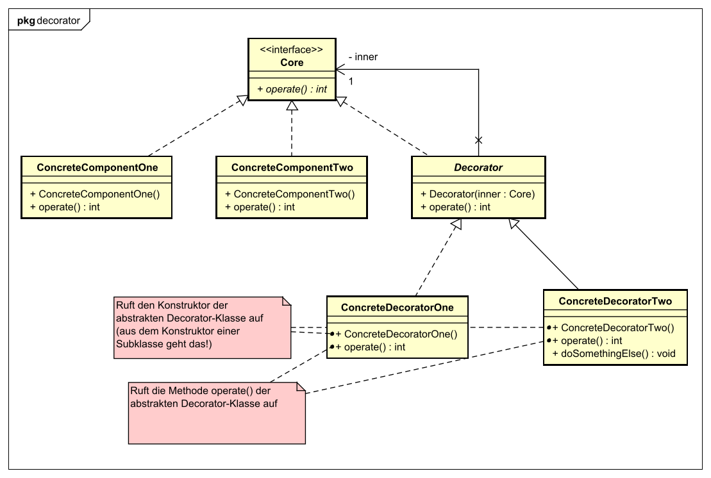

[&larr; Zurück zu *Design Patterns*](../)  
[&larr; Zurück zur Übersicht](../../README.md)

# Decorator Pattern

### Problembeschreibung

Das Decorator Pattern wird eingesetzt, wenn es Basisklassen gibt, die durch verschiedene **Erweiterungen** mit Verhalten erweitert werden (im Beispiel weiter unten gibt Hauptgerichte, die mit verschiedenen Beilagen "erweitert" werden können).

Man könnte einfach für jede mögliche Kombination von Basisklasse und Erweiterung eine **eigene Klasse** erstellen. Das hätte aber einige **Nachteile**:

- So kann es schnell dazu kommen, dass man ein regelrechtes **Klassenchaos** hat, weil die Anzahl an Kombinationen schnell wächst. Wenn eine neue Basisklasse dazu kommt, müssen neue Klassen für **alle möglichen Kombinationen** erstellt werden.
- Wenn sich der Code für eine Basisklasse oder Erweiterung ändert, dann müssen **alle Klassen geändert werden**, die eine Kombination mit diesem Element darstellen - der Wartungsaufwand ist also sehr hoch!
- Man kann **nicht beliebig viele Erweiterungen** zu einer Basisklasse hinzufügen - nur so viele, dass für die Kombination noch eine Klasse existiert.
- Man kann **zur Laufzeit keine Erweiterungen** mehr hinzufügen - dazu müsste man das komplette Objekt gegen das einer anderen Klasse austauschen.

Das Decorator Pattern bietet die Möglichkeit, Erweiterungen für eine Basisklasse **zur Laufzeit anzupassen**, löst das Problem der Wartungsarbeit und kommt dabei mit viel weniger Klassen aus.


### Lösung

- Es gibt eine **Klasse für jede Basisklasse**. Diese hat den grundlegenden Code.
- Es gibt auch eine **Klasse für jede Erweiterung**. Man kann Objekte beliebig mit einer Erweiterung "einpacken", um **zusätzliches Verhalten** hinzuzufügen. Das Erweiterungs-Objekt hat dabei eine **Referenz auf das eingepackte Objekt** und kann damit erst dessen Code ausführen und dann die eigene Erweiterung dazu.
- Basisklassen und Erweiterungsklassen implementierten die **selbe Schnittstelle**! Damit kann jede Erweiterung nicht nur eine Basisklasse einpacken, sondern auch eine **andere Erweiterung**, die dann die Basisklasse einpackt. Außerdem kann man so an jeder Stelle statt der Basisklasse auch eine **eingepackte Basisklasse** verwenden.


### Designprinzipien

Die folgenden [Designprinzipien](../prinzipien/) werden vom Decorator Pattern umgesetzt:

- **Extension > Modification** (*Classes should be open for extension, but closed for modification*): Das ist das zentrale Prinzip des Decorator Patterns. Durch die Erweiterungen kann das Verhalten von Klassen angepasst werden – ohne, dass die Basisklassen verändert werden müssen.
- **Interface > implementation** (*Program to an interface, not an implementation*): Durch das gemeinsame Interface wird erreicht, dass jede Erweiterung (*Decorator*) nicht nur Basisklassen, sondern auch andere Erweiterungen einpacken kann.
- **Composition > inheritance** (*Favor composition over inheritance*): Im Decorator-Pattern gibt es zwar eine Vererbungsstruktur, aber nur, damit ein gemeinsames Interface existiert. Das „Einpacken“ funktioniert nicht über eine Subklasse, sondern über Komposition (mit einer Referenz auf das eingepackte Objekt).
- **Encapsulate what varies** (*Identify the aspects of your application that vary and separate them from what stays the same*): Beim Decorator-Pattern werden die Basisklassen von den Erweiterungen getrennt. Das ist zwar nicht exakt das, was dieses Designprinzip aussagt, geht aber in die Richtung.


### Begriffe für die Klassen

- **Component**: Das ist das Interface, das **von allen Klassen implementiert** wird - von Basisklassen genauso wie von Erweiterungen. Damit sind Basisklassen und Erweiterungen **austauschbar**.

- **Concrete Components**: Das sind die Basisklassen. Sie besitzen den **grundlegenden Code**, der durch die Erweiterungsklassen erweitert wird. *Concrete Components* implementieren natürlich das *Component-Interface*.

- **Decorator**: Decorator ist eine abstrakte Klasse, die das *Component*-Interface implementiert. Es ist die Schnittstelle, die von **allen Erweiterungsklassen vererbt** werden muss. *Decorator* definiert auch eine Referenzvariable vom Typ *Component* - diese verweist auf das vom Decorator "eingepackte" Objekt.

  Der Decorator wird als **abstrakte Klasse** ausgeführt, damit man das Attribut, das auf das eingepackte Objekt verweist, schon hier erstellen kann (In Interfaces kann man in Java nur Klassenkonstanten definieren).

  - Das Attribut für das eingepackte Objekt ist *private*. Das bedeutet, dass die *Concrete Decorators* nicht darauf zugreifen können (weil private Attribute nicht vererbt werden). Aber: Dafür gibt es die Methode `operate()` der abstrakten Decorator-Klasse. Diese Methode kann auf das Attribut zugreifen und wiederum die `operate()`-Methode des eingepackten Objekts aufrufen.

    Das ist zwar ein Extra-Schritt, den man vermeiden könnte – dafür kann aber das Attribut *private* bleiben.

  - Die Decorator-Klasse hat auch einen Konstruktor! Da es sich um eine abstrakte Klasse handelt, kann dieser Konstruktor nicht einfach benutzt werden, um ein Objekt zu erzeugen. Aber: Die Subklassen (die *Concrete Observers*) können jeweils in ihrem Konstruktor den der abstrakten Decorator-Klasse aufrufen. Damit kann dann das Attribut für das eingepackte Objekt gesetzt werden.

- **Concrete Decorator**: Das sind die **eigentlichen Erweiterungsklassen**, die von der abstrakten Klasse *Decorator* erben. Sie packen ein Objekt vom Typ *Component* ein (das kann entweder ein *Concrete Component* sein, also eine Basisklasse ohne Erweiterungen, oder ein *Concrete Decorator*, also eine Erweiterungsklasse, sie selbst schon einen *Component* einpackt). Wenn eine Methode eines Concrete Decorators aufgerufen wird, wird dieser Aufruf **an das eingepackte Objekt weitergeleitet**. Davor oder danach fügt der Concrete Decorator dann das eigene Verhalten hinzu.




### Beispiel: Hauptspeisen mit Beilagen

#### Das Component-Interface: Dish

*Dish* (also *Speise*) ist das Component-Interface, das von allen anderen Klassen implementiert werden muss. Klar - jede Hauptspeise für sich allein ist eine Speise, und jede Hauptspeise, die durch eine Beilage erweitert wurde, ist auch eine Speise.

```java
public interface Dish {
    
    String getDescription();
    float getPrice();
}
```


#### Ein Concrete Component: Steak

Steak ist eine Hauptspeise - noch für sich allein, also ohne Beilage. Steak implementiert das Interface *Dish* - es hat also auch die Methoden `getDescription()` und `getPrice()`.

``````java
public class Steak implements Dish {
    
    String getDescription() {
        return "This is a nice medium rare steak";
    }
    
    float getPrice() {
        return 18.90;
    }
}
``````


#### Die abstrakte Klasse Decorator: SideDish

SideDish ist die abstrakte Klasse, die als gemeinsame Schnittstelle für alle Concrete Decorators fungiert. Sie legt ein Attribut `inner` fest, das auf das eingepackte Objekt verweist. Dieses Attribut ist `private`.

Damit trotzdem mit dem eingepackten Objekt gearbeitet werden kann (obwohl es nicht an die *Concrete Decorators* vererbt wird), muss die abstrakte Decorator-Klasse die Methoden des *Component*-Interfaces sowie einen Konstruktor implementieren.

``````java
public abstract class SideDish implements Dish {
    
    private Dish inner;
    
    public SideDish(Dish inner) {
        this.inner = inner;
    }
    
    public getDescription() {
        return this.inner.getDescription();
    }
    
    public getPrice() {
        return this.inner.getPrice();
    }
}
``````


#### Ein Concrete Decorator: Potatoes

Als Beilage zu den Hauptspeisen (zum Beispiel zum Steak von oben) können verschiedene Beilagen gewählt werden - Kartoffeln sind eine davon. Wenn Kartoffeln als Beilage gewählt werden, dann packt die Klasse `Potatoes` die Hauptspeise ein und fügt ihre eigene Beschreibung und ihren eigenen Preis zu den Methoden `getDescription()` und `getPrice()` hinzu.

Es kann einfach nur eine Hauptspeise eingepackt werden. Wenn ein Gast aber zwei Beilagen bestellt hat, dann kann auch die Hauptspeise in eine Beilage und diese in die zweite Beilage eingepackt werden. Deshalb ist der Typ des Attributs `inner` in der abstrakten Klasse `SideDish` auch `Dish` - er kann also für Hauptspeisen und auch für Beilagen benutzt werden.

``````java
public class Potatoes {
    
    public Potatoes(Dish inner) {
        super(inner);
    }
    
    public String getDescription() {
        return super.getDescription() + " with potatoes";
    }
    
    public float getPrice() {
        return super.getPrice() + 2.40;
    }
}
``````

Hier sieht man gut wie die Erweiterung funktionieren kann: In der Klasse Potatoes wird zuerst die entsprechende Methode des eingepackten Objekts aufgerufen, dann wird noch eigener Code hinzugefügt.

Weil das Attribut `inner` der abstrakten `SideDish`-Klasse `private` ist, kann es von hier aus nicht direkt aufgerufen werden. Stattdessen muss `super` benutzt werden, um den Konstruktor bzw. die Methoden der Superklasse aufzurufen.


#### Eine mögliche Verwendung

Hier soll nur kurz gezeigt werden, wie man `SideDish`-Objekte benutzt, um damit Speisen einzupacken

``````java
/**
 * Bestellen von einem Steak mit Kartoffeln.
 * Natürlich würde das in der Realität mit einer einzigen Methode mit Parametern
 * umgesetzt werden. Das hier ist nur zu Demonstrationszwecken.
 */
public Dish orderSteakWithPotatoes() {
    Dish mySteak = new Steak();
    mySteak.getPrice(); //gibt 18.90 zurück
    mySteak.getDescription(); //gibt "This is a nice medium rare steak" zurück
    
    Dish mySteakWithPotatoes = new Potatoes(mySteak);
    mySteakWithPotatoes.getPrice(); //gibt 21.30 zurück
    mySteakWithPotatoes.getDescription(); 
    //gibt "This is a nice medium rare steak with potatoes" zurück
    
    return mySteakWithPotatoes;
}
``````


### Quellen

[Philipp Hauer: Das Decorator Design Pattern](https://www.philipphauer.de/study/se/design-pattern/decorator.php)