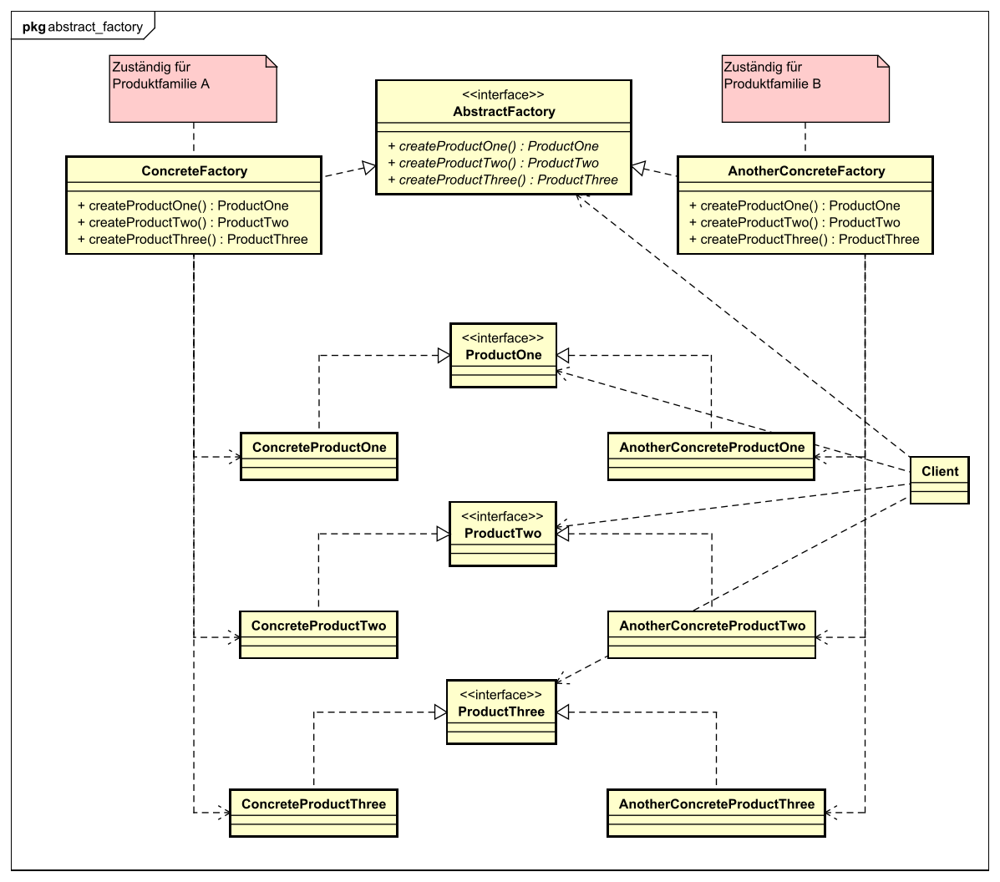

[<small>Zurück zum *Factory Pattern*</small>](../)  
[<small>Zurück zu *Design Patterns*</small>](../../)  
[<small>Zurück zur Übersicht</small>](../../../)

# Abstract Factory Pattern

<small>[zum *Factory Method Pattern*](../factory-method/)</small>

### Problembeschreibung

- In jedem Programm müssen irgendwann einmal **Objekte erstellt werden**.
- Oft geht es dabei um unterschiedliche Varianten - also unterschiedliche **Implementierungen des selben Interfaces** (in den Beispielen verschiedene Pizza-Sorten).
- Der Code zum Erstellen von Objekten sollte **nicht im Client-Code enthalten** sein, denn dann wäre das Design-Prinzip **Extension > Modification** (*Classes should be open for extension, but closed for modification*) verletzt. Wenn eine neue Klasse dazukommt, die das Interface auch implementiert, dann muss der Client-Code verändert werden!


### Lösung

- Der Code zum Erstellen wird in **externe Klassen ausgelagert**. Diese Klassen haben eine einzige Aufgabe: **Objekte erstellen**. Sie werden deshalb passend **Fabriken** (englisch: *Factories*) genannt.
- Es gibt ein Interface für alle Fabriken, das die **Methoden zum Erstellen von Objekten definiert**. In diesem Interface gibt es aber **keine implementierten Methoden**!
- Konkrete Klassen, die von diesem Interface erben, müssen die Methoden zur Erstellung von Objekten implementieren.


### Begriffe für die Klassen

- **Abstract Factory**: Das entspricht in etwa der Factory im *Factory Method Design Pattern*. Die Klasse ist hier aber ein Interface und hat nur abstrakte Methoden.

(für alle anderen Klassen: siehe [Factory Method Pattern](../factory-method/))




### Unterschied zu Factory Method

- Der Hauptunterschied zwischen den Design Patterns **Abstract Factory** und **Factory Method** ist, dass bei Factory Method **nur eine Methode abstrakt** ist. Daneben kann die abstrakte Factory-Klasse aber noch **andere Methoden implementiert haben**.
- Bei Abstract Factory gibt es **einfach nur ein Interface ohne implementierte Methoden**. Die Implementierung wird **komplett** den Subklassen, den *Concrete Factories*, überlassen.

- Typischerweise erzeugen die Concrete Factories im **Abstract Factory** Design Pattern **mehrere verschiedene Produkte**.


### Beispiel: Der Pizza-Shop als Abstract Factory

#### Die Abstract Factory: PizzaShop

`PizzaShop` ist zuständig für das "Erstellen", Belegen, Backen und servieren der Pizzen.

```java
public interface PizzaShop {
    public abstract Pizza createPizza(String type);
}
```

Jede Pizza-Art wird anders erstellt - sie wird anders belegt, ist vielleicht größer oder kleiner, hat einen Knoblauchrand oder nicht... Deshalb gibt es die abstrakte Methode, die erst von den konkreten Subklassen implementiert werden muss.


#### Eine Concrete Factory: ItalianPizzaShop

Neben den unterschiedlichen Pizzen (wie Margherita, Cardinale, Funghi, Capricciosa,...) gibt es auch noch unterschiedliche Varianten: Zum Beispiel die italienische mit dünnem Boden und die amerikanische mit flaumigem Boden und gefülltem Rand...

Auch das ist ein Vorteil des Abstract Factory Patterns: Es gibt normalerweise mehrere Concrete Factories, die unterschiedliche Produktvarianten erzeugen!

Der `ItalianPizzaShop` erzeugt also italienische Pizzen (der Einfachheit halber gibt es nur drei Pizzen zur Auswahl).

```java
public class ItalianPizzaShop implements PizzaShop {
    
    public Pizza createPizza(String type) {
        switch (type) {
            case "margherita":	return new ItalianMargheritaPizza();
            case "cardinale":	return new ItalianCardinalePizza();
            case "capricciosa":	return new ItalianCapricciosaPizza();
            default:			return null;
        }
    }
}
```


#### Eine weitere Concrete Factory: AmericanPizzaShop

Der `AmericanPizzaShop` erzeugt die selben drei Pizzen wie der `ItalianPizzaShop`, nur auf amerikanische Art.

```java
public class AmericanPizzaShop implements PizzaShop {

    public Pizza createPizza(String type) {
        switch (type) {
            case "margherita":	return new AmericanMargheritaPizza();
            case "cardinale":	return new AmericanCardinalePizza();
            case "capricciosa":	return new AmericanCapricciosaPizza();
            default:			return null;
        }
    }
}
```


#### Das Product-Interface: Pizza

Wie genau das Product-Interface aufgebaut ist, ist für dieses Beispiel nicht wirklich wichtig. Aber auf jeden Fall muss es eines geben, damit Polymorphie möglich ist.

```java
public interface Pizza {
	//Code...
}
```


#### Ein Beispiel für ein Concrete Product: ItalianMargheritaPizza

Auch beim Concrete Product ist nicht so wichtig, wie es aufgebaut ist. Aber es muss auf jeden Fall das Product-Interface `Pizza` implementieren.

```java
public class ItalianMargheritaPizza implements Pizza {
    //Code...
}
```


#### Der Code im Client

Für den Client wird es jetzt ganz einfach: Er braucht nur eine Instanz des `PizzaShop`s (also entweder `ItalianPizzaShop` oder `AmericanPizzaShop`) und kann mit einem einzigen Methodenaufruf eine Pizza-Bestellung aufgeben:

```java
public class Client {
    
    private PizzaShop shop;
    //Andere Attribute...
    
    public Client() {
        //Andere Initialisierungen...
        this.shop = new ItalianPizzaShop();
    }
    
    public void irgendeineMethode() {
        Pizza pizza = this.shop.createPizza("margherita");
    }
}
```

Die Zeile `this.shop.createPizza("margherita");` erledigt das Erstellen der Pizza. Dafür steht im Client-Code nicht einmal ein `new`-Operator! Die Erstellung der Pizza wurde ausgelagert.


#### Hinweise

- Ja, ich habe hier für jede Pizza-Variante eine eigene Klasse benutzt... Hier würde sich vielleicht eine Kombination mit dem Decorator-Pattern anbieten.
- Im Gegensatz zum Beispiel im Factory Method Pattern gibt es hier keine Methode `orderPizza()`, die nach dem Erstellen des Pizza-Objekts die Pizza noch bäckt und zustellt. Wenn die einzelnen Factories auch Verhalten gemeinsam haben sollen, eignet sich dafür das Factor Method Pattern vielleicht besser.