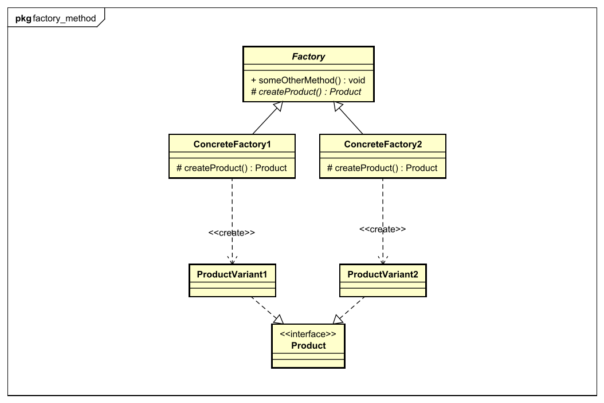

[<small>Zurück zum *Factory Pattern*</small>](../)  
[<small>Zurück zu *Design Patterns*</small>](../../)  
[<small>Zurück zur Übersicht</small>](../../../)

# Factory Method Pattern

[<small>Zum *Abstract Factory Pattern*</small>](../abstract-factory/)

### Problembeschreibung

- In jedem Programm müssen irgendwann einmal **Objekte erstellt werden**.
- Oft geht es dabei um unterschiedliche Varianten - also unterschiedliche **Implementierungen des selben Interfaces** (in den Beispielen verschiedene Pizza-Sorten).
- Der Code zum Erstellen von Objekten sollte **nicht im Client-Code enthalten** sein, denn dann wäre das Design-Prinzip **Extension > Modification** (*Classes should be open for extension, but closed for modification*) verletzt. Wenn eine neue Klasse dazukommt, die das Interface auch implementiert, dann muss der Client-Code verändert werden!
- Ein weiterer Punkt ist: Oft werden die Objekte nach der Erstellung noch über ihre Methoden **konfiguriert** - und zwar für alle Varianten auf die selbe Weise. Nach dem Design-Prinzip **Encapsulate what varies** (*Identify the aspects of your application that vary and separate them from what stays the same.*) sollte diese Konfiguration - die ja **für alle Klassen gleichbleibt** - von der Objekterstellung - die **für jede Klasse unterschiedlich ist** - getrennt werden!


### Lösung

- Der Code zum Erstellen wird in **externe Klassen ausgelagert**. Diese Klassen haben eine einzige Aufgabe: **Objekte erstellen**. Sie werden deshalb passend **Fabriken** (englisch: *Factories*) genannt.
- Es gibt eine abstrakte Klasse, die die oben angesprochene **Konfiguration** der Objekte übernimmt und eine **abstrakte Methode zum Erstellen von den Objekten** hat - die sogenannte *Factory Method*.
- Konkrete Klassen, die von dieser abstrakten Klasse erben, müssen die abstrakte Methode zur Erstellung von Objekten implementieren.
- Der Code für die **weitere Konfiguration bleibt der selbe** - die konkreten Subklassen benutzen dafür einfach die Methode der abstrakten Superklasse.


### Begriffe für die Klassen

- **Factory**: Die Factory ist die abstrakte Superklasse für alle Factories. Man könnte sie auch *Abstract Factory* nennen, aber das mache ich zur Abgrenzung vom *Abstract Factory Design Pattern* nicht. Die Factory hat:
  - eine (oder mehrere) abstrakte Methoden zur Objekterstellung - die **factory methods**.
  - und konkrete Methoden für die Konfiguration (und andere Dinge).
- **Concrete Factory**: Das sind die konkreten Subklassen, die von *Factory* erben und die *factory methods* implementieren. Für alles Andere, also zum Beispiel die Konfiguration der erstellten Objekte, greifen sie auf den Code der Factory zu.
- **Product**: Das ist das gemeinsame Interface der Objekte, die erstellt werden.
- **Concrete Product**: Das ist eine Klasse für eine ganz bestimmte Produktvariante.




### Beispiel: Pizza-Restaurant

#### Die Factory: PizzaShop

`PizzaShop` ist zuständig für das "Erstellen", Belegen, Backen und servieren der Pizzen.

``````java
public abstract class PizzaShop {
	
    public void orderPizza(String type) {
        
        Pizza pizza = createPizza(); //Aufruf der abstrakten factory method
        
        pizza.bake();
        pizza.serve();
    }
    
    protected abstract Pizza createPizza(String type);
}
``````

Das Backen und Servieren ist ja für alle Pizzen gleich - deshalb enthält die Factory dafür den Code.

Allerdings wird jede Pizza-Art anders erstellt - sie wird anders belegt, ist vielleicht größer oder kleiner, hat einen Knoblauchrand oder nicht... Deshalb ist die **Factory method** abstrakt und muss erst von den konkreten Subklassen implementiert werden.

Die factory method ist außerdem **protected**, damit sie vom Client nicht direkt, sondern nur über `orderPizza()` aufgerufen werden kann.


#### Eine Concrete Factory: ItalianPizzaShop

Neben den unterschiedlichen Pizzen (wie Margherita, Cardinale, Funghi, Capricciosa,...) gibt es auch noch unterschiedliche Varianten: Zum Beispiel die italienische mit dünnem Boden und die amerikanische mit flaumigem Boden und gefülltem Rand...

Auch das ist ein Vorteil des Factory Method Patterns: Es kann mehrere Concrete Factories geben, die unterschiedliche Produktvarianten erzeugen!

Der `ItalianPizzaShop` erzeugt also italienische Pizzen (der Einfachheit halber gibt es nur drei Pizzen zur Auswahl).

``````java
public class ItalianPizzaShop extends PizzaShop {
    
    protected Pizza createPizza(String type) {
        switch (type) {
            case "margherita":	return new ItalianMargheritaPizza();
            case "cardinale":	return new ItalianCardinalePizza();
            case "capricciosa":	return new ItalianCapricciosaPizza();
            default:			return null;
        }
    }
}
``````


#### Eine weitere Concrete Factory: AmericanPizzaShop

Der `AmericanPizzaShop` erzeugt die selben drei Pizzen wie der `ItalianPizzaShop`, nur auf amerikanische Art.

``````java
public class AmericanPizzaShop extends PizzaShop {

    protected Pizza createPizza(String type) {
        switch (type) {
            case "margherita":	return new AmericanMargheritaPizza();
            case "cardinale":	return new AmericanCardinalePizza();
            case "capricciosa":	return new AmericanCapricciosaPizza();
            default:			return null;
        }
    }
}
``````


#### Das Product-Interface: Pizza

Wie genau das Product-Interface aufgebaut ist, ist für dieses Beispiel nicht wirklich wichtig. Aber auf jeden Fall muss es eines geben, damit Polymorphie möglich ist.

``````java
public interface Pizza {
	//Code...
}
``````


#### Ein Beispiel für ein Concrete Product: ItalianMargheritaPizza

Auch beim Concrete Product ist nicht so wichtig, wie es aufgebaut ist. Aber es muss auf jeden Fall das Product-Interface `Pizza` implementieren.

``````java
public class ItalianMargheritaPizza implements Pizza {
    //Code...
}
``````


#### Der Code im Client

Für den Client wird es jetzt ganz einfach: Er braucht nur eine Instanz des `PizzaShop`s (also entweder `ItalianPizzaShop` oder `AmericanPizzaShop`) und kann mit einem einzigen Methodenaufruf eine Pizza-Bestellung aufgeben:

``````java
public class Client {
    
    private PizzaShop shop;
    //Andere Attribute...
    
    public Client() {
        //Andere Initialisierungen...
        this.shop = new ItalianPizzaShop();
    }
    
    public void irgendeineMethode() {
        Pizza pizza = this.shop.orderPizza("margherita");
    }
}
``````

Die Zeile `this.shop.orderPizza("margherita");` erledigt alles, was für eine Pizza-Bestellung notwendig ist: Die gewünschte Pizza wird erstellt, gebacken und serviert. Dafür steht im Client-Code nicht einmal ein `new`-Operator! Die Erstellung der Pizza wurde ausgelagert.


#### Hinweis

Ja, ich habe hier für jede Pizza-Variante eine eigene Klasse benutzt... Hier würde sich vielleicht eine Kombination mit dem Decorator-Pattern anbieten.