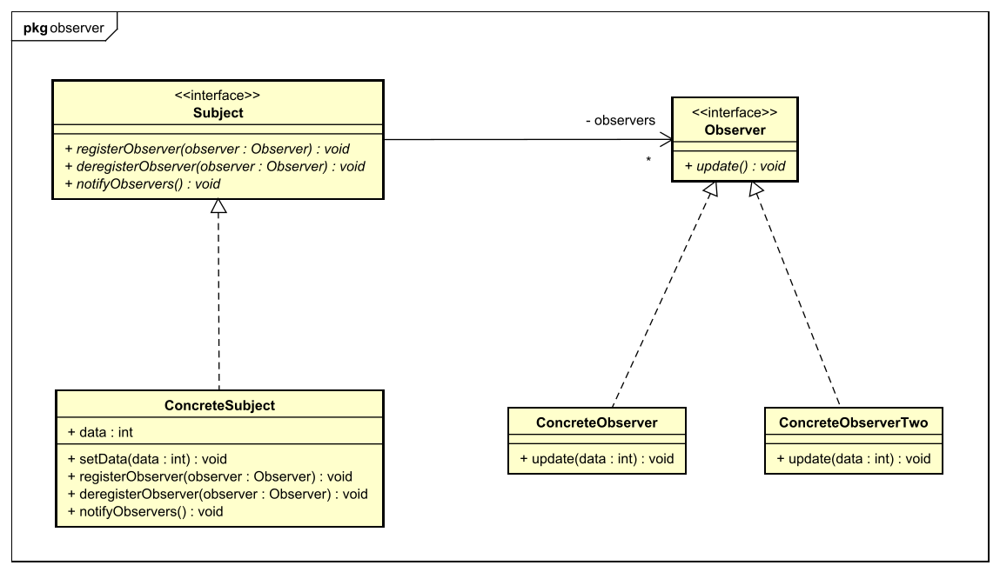
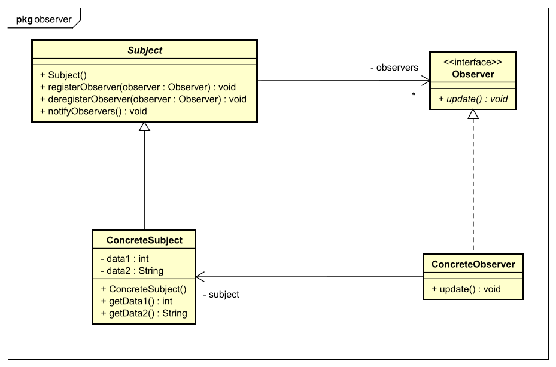

[&larr; Zurück zu *Design Patterns*](../)  
[&larr; Zurück zur Übersicht](../../README.md)

# Observer Pattern

### Problembeschreibung

- Beim Observer Pattern geht es um ein Daten-Objekt, dessen Daten sich **regelmäßig ändern**.
- Andere Objekte, die mit diesen Daten arbeiten (zum Beispiel Bildschirmfenster, die Daten anzeigen), sollten natürlich möglichst **aktuell sein** und immer mit den neuesten Daten arbeiten.
- Natürlich könnten diese Objekte einfach regelmäßig selbst überprüfen, ob sich die Daten geändert haben. Aber dann könnten sie trotzdem nicht sofort, sondern erst nach einiger Zeit auf Änderungen reagieren, und durch die dauernden Abfragen wäre das System unnötig belastet.

Es muss also eine Möglichkeit geben, wie das Daten-Objekt **selbst aktiv wird** und die abhängigen Objekte über Änderungen der Daten informiert! Hier kommt das Observer Pattern ins Spiel.  


### Lösung

- Die Objekte, die die Daten brauchen, können sich **beim Datenobjekt registrieren**.
- Wenn sich beim Datenobjekt etwas ändert, werden die registrierten Objekte darüber **benachrichtigt** und können dann darauf reagieren (die Anzeige aktualisieren usw.)
- Natürlich können sich die Objekte beim Datenobjekt auch wieder **abmelden** und werden dann nicht mehr benachrichtigt.


### Begriffe für die Klassen

- **Subject**: Das ist das "Daten-Objekt". Das Subject besitzt Daten, die sich immer wieder ändern.
- **Observer**: Observer sind Objekte, die mit Daten vom Subject arbeiten. Sie können sich beim Subject registrieren lassen und werden dann so lange über Änderungen der Daten benachrichtigt, bis sie sich wieder abmelden.


### Zwei Varianten: Push und Pull

Das Observer-Pattern kann auf zwei verschiedene Arten umgesetzt werden: Mit dem *Pull*- und dem *Push*-Prinzip. Diese Bezeichnungen beziehen sich darauf, ob die Daten vom Subject an die Observer „gepusht“ werden, oder ob die Observer die Daten selbst vom Subject „pullen“ müssen.

Keines dieser beiden Prinzipien ist grundsätzlich besser oder schlechter als das andere. Es hängt immer vom konkreten Anwendungsfall ab, welches sich besser eignet.


#### Das Push-Prinzip

Beim Push-Prinzip **übergibt das Subject gleich beim Benachrichtigen** die Daten an die Observer (siehe Signatur von `update()` im Interface `Observer`: Hier wird ein Parameter vom Typ `Object` übergeben).



Warum hat das Parameter den Typ `Object`? Ein wichtiges [Design-Prinzip](../prinzipien/) beim Observer-Pattern ist das Prinzip der losen Kopplung, das besagt, dass Klassen nur möglichst wenig Detailwissen voneinander haben sollten. Das ermöglicht es, Schnittstellen aufzubauen, die mit unterschiedlichen Klassen kompatibel sind.

Natürlich könnte man im `Observer`-Interface auch eine Methode `update(int, int, String, double)` definieren, wenn das die Daten sind, die das konkrete Subject verwaltet. Dann könnte man den Observer aber nur noch in diesem konkreten Anwendungsfall und in Kombination mit diesem konkreten Subject einsetzen.

Eine allgemein gehaltene Signatur bewirkt, dass der Observer universell eingesetzt werden kann. Und die Klasse `Object` ermöglicht es, dass irgendein Objekt übergeben wird. Man kann also eine eigene Daten-Klasse definieren, die alle Daten speichert, und dann ein Objekt dieser Datenklasse übergeben – wie hier mit der Klasse `Data` getan. Oder man verwendet das Pull-Prinzip.


#### Das Pull-Prinzip

Beim Pull-Prinzip benachrichtigt das Subject die Observer darüber, dass neue Daten vorliegen, **übergibt diese Daten aber nicht**. Die Observer können die Daten daraufhin über Getter-Methoden vom Subject abfragen.

Das Klassendiagramm dazu sieht so aus:



Gegenüber dem Push-Prinzip fallen zwei Unterschiede auf:

1. Die Methode `update()` im Interface `Observer` hat **keine Parameter**. Die sind nicht nötig, weil die Daten ja beim Benachrichtigen noch nicht übergeben werden. Deswegen ist es auch nicht notwendig, unbedingt eine Datenklasse zu erstellen, die alle Daten in *ein Objekt* verpackt wie beim Pull-Prinzip.
2. Die *Concrete Observer* **haben eine Referenz auf die *Concrete Subjects***. Die brauchen sie, damit sie die Daten abfragen können. Nachdem beim Observer-Pattern ja eigentlich das Prinzip der *losen Kopplung* wichtig ist, bei dem die Klassen möglichst wenig voneinander wissen, ist diese Verbindung nicht ideal. Die *Concrete Observers* müssen genau wissen, welche Daten die *Concrete Subjects* verwalten und wie sie diese abfragen können. Das ist kein großes Problem (weil die Concrete Observers immerhin nur eine Implementierung sind und kein allgemeines Interface), aber ideal ist es auch nicht.


#### Vergleich der Prinzipien

Designtechnisch sind also beide Prinzipien nicht perfekt: Das *Push*-Prinzip muss, um sich an das allgemeine `Observer`-Interface zu halten, alle Daten in *ein* Objekt verpacken. Das *Pull*-Prinzip hat dafür eine Assoziation zwischen den *Concrete Observers* und den *Concrete Subjects*, die dem Prinzip der losen Kopplung widerspricht.

Aber was sind – abgesehen von diesen designtechnischen Fragen – die anderen Vor- und Nachteile des *Push*- und *Pull*-Prinzips?

- Ein **Vorteil von Pull** ist, dass nicht alle Daten abgefragt werden müssen. Nicht jeder *Concrete Observer* braucht alle Daten vom *Concrete Subject*. Wenn die Observer nur benachrichtigt werden, können sie selbst entscheiden, ob und welche Daten sie abrufen und aktualisieren wollen.
- Bei **Push** werden gleich bei der Benachrichtigung auch die Daten übergeben. Performancetechnisch kann das ein **Vorteil** sein, wenn man sich dadurch weitere Methodenaufrufe von Getter-Methoden spart. Es kann aber auch ein **Nachteil sein**: Nämlich dann, wenn sehr große Mengen an Daten übertragen werden, oder wenn sich die Daten sehr oft ändern (zum Beispiel bei einem Sensorwert, der jede Millisekunde neu ausgelesen wird). Wenn die nicht alle Daten oder alle Updates brauchen, kann das Übertragen der Daten zu einem unnötig hohen Performance-Aufwand führen.

Es hängt also vom Anwendungsfall ab, ob man das *Pull*- oder das *Push*-Prinzip verwenden möchte.


### Das Design-Prinzip der losen Kopplung

Das (nach meiner Nummerierung) vierte [Design-Prinzip](../prinzipien/) besagt: *Strive for loosely coupled designs between objetcs that interact*. Diese lose Kopplung ist beim Observer-Pattern gut umgesetzt, denn:

- Die grundlegenden Komponenten (*Subject* und *Observer*) haben nur **wenig Detailwissen** voneinander.
- Beim *Push*-Prinzip existiert darüber hinaus **keine Verbindung** zwischen den *Concrete Observers* und den *Concrete Subjects*.
- Beim *Pull*-Prinzip gibt es diese Verbindung schon. Das ist zwar nicht ideal, aber kein großes Problem.


### Beispiel: Wetterdaten

Anmerkung: Im folgenden Beispiel wurde das Pull-Prinzip verwendet.  

#### Die abstrakte Klasse `Subject`

Die abstrakte Klasse Subject implementiert nur die drei wichtigen, allgemeinen Methoden `registerObserver()`, `deregisterObserver()` und `notifyObservers()`.

```java
public abstract class Subject {

    private List<Observer> observers;

    public Subject() {
        this.observers = new ArrayList<>();
    }

	public void registerObserver(Observer o) {
        this.observers.add(o);
    }

	public void deregisterObserver(Observer o) {
	    this.observers.remove(o);
    }

	public void notifyObservers() {
	    for (Observer o : this.observers) {
	        o.update();
        }
    }
}
```


#### Das konkrete Subject: WeatherData

Die Klasse WeatherData verwaltet Wetterdaten: Temperatur, Luftfeuchtigkeit und Luftdruck. Diese Daten werden in Attributen gespeichert. Außerdem gibt es eine `ArrayList`, in die alle Observer gespeichert werden

``````java
private float temperature;
private float humidity;
private float pressure;
``````

Sie hat also Methoden, um die Werte zu setzen und auszulesen

```java
public void setMeasurements(float temperature, float humidity, float pressure) {
    this.temperature = temperature;
    this.humidity = humidity;
    this.pressure = pressure;

    // Die Observer über die Datenänderung benachrichtigen
    super.notifyObservers();
}

public float getTemperature() {
    return this.temperature;
}

public float getHumidity() {
    return this.humidity;
}

public float getPressure() {
    return this.pressure;
}
```

Wenn `setMeasurements()` aufgerufen wird, werden alle Observer über die Methode `notifyObservers()` der abstrakten Superklasse `Subject` aufgerufen.


#### Das Interface Observer

Das Observer-Interface definiert nur eine einzige Methode `update()`, um von Änderungen von Daten im Subject benachrichtigt zu werden. Diese Methode hat - wie es beim Pull-Prinzip gehört - keine Parameter

``````java
public interface Observer {
    
	void update();
}
``````


#### Ein konkreter Observer: CurrentConditionsDisplay

CurrentConditionsDisplay soll bei Änderungen der Wetterdaten die Werte der Temperatur und der Luftfeuchtigkeit in die Konsole ausgeben. Der Luftdruck wird hier **nicht gebraucht**. 

Im Konstruktor wird ein WeatherData-Objekt übergeben. Dieses Objekt wird beim Pull-Prinzip gebraucht, weil ja die Daten **ausgelesen werden müssen**. Außerdem trägt sich ein neu erstelltes CurrentConditionsDisplay auch gleich beim WeatherData-Objekt **als Observer ein**.

``````java
public CurrentConditionsDisplay(WeatherData weatherData) {
    this.weatherData = weatherData;
    this.weatherData.registerObserver(this);
}
``````

Beim Aufruf von `update()` werden **keine Parameter** übergeben. Stattdessen werde die Werte, die benötigt werden (also Temperatur und Luftfeuchtigkeit, aber nicht Luftdruck) **mit Getter-Methoden ausgelesen**.

``````java
public void update() {
    this.temperature = this.weatherData.getTemperature();
    this.humidity = this.weatherData.getHumidity();
    this.display();
}
``````

`display()` gibt dann die Daten in die Konsole aus...

``````java
public void display() {
    System.out.println(String.format("Current conditions: %f ° C and %f %% humidity",
                                     this.temperature, this.humidity));
}
``````