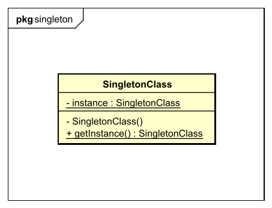

[<small>Zurück zu *Design Patterns*</small>](../)  
[<small>Zurück zur Übersicht</small>](../../)

# Singleton Pattern

## In a nutshell

Das Singleton-Pattern ist ein *Creational Design Pattern*, das sicherstellt, dass von einer Klasse nur eine Instanz existiert.


## Die Grundlagen

### Das Problem

In Software-Projekten gibt es immer wieder Fälle, in denen sichergestellt werden muss, dass von einer Klasse genau *eine* Instanz existiert – und nicht mehr: Zum Beispiel bei Loggern oder bei Schnittstellen zu anderen Software- oder Hardware-Komponenten.

So lange die Klasse allerdings einen Public-Konstruktor hat, kann sie beliebig oft instanziert werden. Einfach nur darauf vertrauen, dass das nicht passiert, reicht natürlich nicht aus. Eine andere Möglichkeit wäre, dass der Konstruktor nur beim ersten Aufruf funktioniert und danach keine Instanzen mehr erzeugt, sondern nur noch Fehler wirft. In diesem Fall ist es dann aber schwierig, eine Referenz auf das bereits existierende Objekt zu bekommen.

Man könnte die Klasse auch einfach durch globale Variablen und Funktionen ersetzen. Davon wird aber oft abgeraten, und in manchen Programmiersprachen (wie Java) sind globale Variablen und Funktionen gar nicht möglich.


### Die Lösung

Als Lösung für das oben beschriebene Problem wird im Singleton-Pattern bei der Klasse, von der es nur eine Instanz geben soll, der Konstruktor auf *private* gesetzt. Dadurch ist er von außerhalb der Klasse nicht mehr aufrufbar, es können also nicht mehr beliebig viele Instanzen erstellt werden.

Um auf die *eine* existierende Instanz zuzugreifen, gibt es eine statische Zugriffsmethode (in Java häufig `getInstance()`). Wenn diese Methode aufgerufen wird und noch keine Instanz der Singleton-Klasse existiert, wird eine erstellt und zurückgegeben. Ab dann wird immer die bereits existierende Instanz zurückgegeben.


#### Das Klassendiagramm



Das UML-Klassendiagramm für das Singleton-Pattern ist sehr klein und einfach – weil es nur eine einzige Klasse enthält: Die Singleton-Klasse.

- `SingletonClass`: Die *Singleton-Klasse* ist die Klasse, von der nur eine Instanz existieren soll. Gleichzeitig kann man über diese Klasse auch auf die Instanz zugreifen.
- `instance`: Das ist eine statische Klassenvariable für die Instanz. Die Variable ist *private*, auf sie kann also von außerhalb der Klasse nicht zugegriffen werden. Die Referenz für die Instanz wird in der Singleton-Klasse selbst gespeichert und wird, wenn sie benötigt wird, an andere Klassen weitergegeben.
- `SingletonClass()`: Hierbei handelt es sich um den Konstruktor für die Singleton-Klasse. Auch dieser Konstruktor ist *private*, kann also von außerhalb der Klasse nicht aufgerufen werden. Damit wird die Möglichkeit, Instanzen der Klasse zu erstellen, eingeschränkt.
- `getInstance()`: Diese statische *Zugriffsmethode* ist die einzige Möglichkeit, von außerhalb eine Instanz der Singleton-Klasse zu erhalten. Sie ist *public*, also von überall aufrufbar. Sie erstellt wenn notwendig eine Instanz der Singleton-Klasse und gibt dann die Instanz zurück.


## Weitere Details

### Lazy und Eager Initialization

Für das Singleton-Pattern gibt es zwei Varianten: *Lazy initialization* (die klassische, in den meisten Fällen bessere Variante) und *eager initialization*.


#### Lazy Initialization

*Lazy initialization* (deutsch: *Faule Initialisierung*) bedeutet, dass die Instanz der Singleton-Klasse erst dann erstellt wird, wenn sie benötigt wird – das ist vergleichbar mit *lazy loading* von Bildern und anderen Inhalten auf Websites. Lazy initialization ist vor allem dann sinnvoll, wenn die Instanz viele Ressourcen beansprucht (zum Beispiel viel Arbeitsspeicher), oder wenn das Erstellen der Instanz aufwändig ist. In diesem Fall soll sie wirklich nur dann erstellt werden, wenn sie gebraucht wird.

##### Beispiel in Java

In der Klasse `LazySingletonClass` wird lazy initialization angewendet. Am Anfang existiert keine Instanz (die Klassenvariable `instance` ist `null`). Wenn `getInstance()` aufgerufen wird, wird zuerst überprüft, ob eine Instanz existiert. Ist das der Fall, wird sie zurückgegeben. Ansonsten wird eine neue Instanz erstellt, in `instance` gespeichert und zurückgegeben.

``````java
public class LazySingletonClass {
    private static LazySingletonClass instance;
    
    private LazySingletonClass() {}
    
    public static LazySingletonClass getInstance() {
        if (instance == null) {
            instance = new LazySingletonClass();
        }
        
        return instance;
    }
}
``````


#### Eager initialization

Das Gegenteil von *lazy initialization* ist *eager initialization* (deutsch: *Eifrige* oder *ungeduldige Initialisierung*). Dabei wird die Instanz gleich beim Laden der Klasse erzeugt und nicht erst dann, wenn sie benötigt wird. Wenn die Instanz aufwändig zu erstellen ist oder viele Ressourcen beansprucht, kann durch eager initialization ein unnötig hoher Aufwand entstehen. Aber auch bei weniger ressourcenintensiven Klassen wird dieses Prinzip eher selten angewendet.

Einen Anwendungsfall gibt es aber dann, wenn die Singleton-Klasse thread-safe sein soll &rarr; siehe [Das Singleton-Pattern und Nebenläufigkeit](#das-singleton-pattern-und-nebenläufigkeit).

##### Beispiel in Java

In diesem Beispiel sieht man, dass die Instanz gleich beim Laden der Klasse erstellt wird. In `getInstance()` muss also nichts mehr überprüft werden, es kann einfach die Instanz zurückgegeben werden.

``````java
public class EagerSingletonClass {
    private static EagerSingletonClass instance = new EagerSingletonClass();
    
    private EagerSingletonClass() {}
    
    public static EagerSingletonClass getInstance() {
        return instance;
    }
}
``````


### Das Singleton-Pattern und Nebenläufigkeit

Wenn man das Singleton-Pattern in einem Multithreading-Kontext anwendet, muss man aufpassen. In der `getInstance()`-Methode kann es nämlich unter Umständen zu Race Conditions kommen.

Möglich ist das, wenn *lazy loading* verwendet wird, also, wenn die Instanz erst erzeugt wird, sobald sie benötigt wird. Wenn noch keine Instanz existiert und dann zwei Threads gleichzeitig eine anfordern, kann folgendes passieren:

| Thread 1                                                     | Thread 2                                                     |
| ------------------------------------------------------------ | ------------------------------------------------------------ |
| Thread 1 ruft `getInstance()` auf                            |                                                              |
|                                                              | Thread 2 ruft `getInstance()` auf                            |
| Der Wert von `instance` ist noch `null`, Thread 1 geht also in den `if`-Block hinein |                                                              |
|                                                              | Der Wert von `instance` ist immer noch `null`, Thread 2 geht also auch in den `if`-Block hinein |
| Es wird eine neue Instanz der Singleton-Klasse erstellt und gespeichert |                                                              |
| Die neue Instanz der Singleton-Klasse wird zurückgegeben, Thread 1 beginnt, damit zu arbeiten |                                                              |
|                                                              | Es wird noch eine neue Instanz der Singleton-Klasse erstellt und gespeichert |
|                                                              | Die neue Instanz wird zurückgegeben und Thread 2 beginnt, damit zu arbeiten. Thread 2 hat jetzt eine andere Instanz als Thread 1. |

Es kann bei mehreren Threads also passieren, dass die Threads unterschiedliche Instanzen der Singleton-Klasse besitzen. Das kann zu Problemen führen – vor allem, weil man ja eigentlich darauf vertraut, dass es nur eine Instanz gibt und man deshalb bei den Methoden der Singleton-Klasse nicht mehr auf Race Conditions und ähnliche Probleme achten muss.


#### Abhilfe 1: Eager initialization verwenden

Die erste und wahrscheinlich einfachste Möglichkeit, das Problem der Race Condition zu vermeiden, ist es, statt lazy initialization auf eager initialization zu setzen. Dabei wird die Singleton-Instanz gleich beim Laden der Klasse erstellt. Alle Aufrufe von `getInstance()` geben dann die selbe Instanz zurück, unabhängig von der Ausführungsreihenfolge.

| Thread 1                                                     | Thread 2                                                     |
| ------------------------------------------------------------ | ------------------------------------------------------------ |
| Thread 1 ruft `getInstance()` auf                            |                                                              |
|                                                              | Thread 2 ruft `getInstance()` auf                            |
| Die Instanz der Singleton-Klasse wird zurückgegeben und Thread 1 kann damit arbeiten |                                                              |
|                                                              | Die Instanz der Singleton-Klasse wird zurückgegeben und Thread 2 kann damit arbeiten. Es handelt sich um die selbe Instanz, mit der auch Thread 1 arbeitet. |


#### Abhilfe 2: Synchronisation der Methode

Wenn man nicht auf die Vorteile von lazy initialization verzichten möchte, kann man die Methodenaufrufe von `getInstance()` synchronisieren und damit verhindern, dass zwei Threads gleichzeitig die Methode aufrufen.

| Thread 1                                                     | Thread 2                                                     |
| ------------------------------------------------------------ | ------------------------------------------------------------ |
| Thread 1 ruft `getInstance()` auf                            |                                                              |
|                                                              | Thread 2 ruft `getInstance()` auf. Weil die Methode synchronisiert ist, muss er noch warten, bis Thread 1 die Methode verlassen hat. |
| Der Wert von `instance` ist noch `null`, Thread 1 geht also in den `if`-Block hinein |                                                              |
| Es wird eine neue Instanz der Singleton-Klasse erstellt und gespeichert |                                                              |
| Die neue Instanz der Singleton-Klasse wird zurückgegeben, Thread 1 beginnt, damit zu arbeiten |                                                              |
|                                                              | Thread 2 kann jetzt die Methode ausführen. Die bereits existierende Instanz der Singleton-Klasse wird zurückgegeben und Thread 2 kann damit arbeiten |

In Java bietet sich dafür das `synchronized`-Keyword an:

``````java
public class SynchronizedSingletonClass {
    private static SynchronizedSingletonClass instance;
    
    private SynchronizedSingletonClass() {}
    
    public static synchronized SynchronizedSingletonClass getInstance() {
        if (instance == null) {
            instance = new SynchronizedSingletonClass();
        }
        
        return instance;
    }
}
``````

In anderen Programmiersprachen wie Python muss die Synchronisation mit einem Lock selbst programmiert werden. In diesem Fall ist die nächste Variante besser an, die mit dem selben Aufwand eine bessere Performance erreicht.


#### Abhilfe 3: Teilweise Synchronisation der Methode

Die zweite, gerade erklärte Möglichkeit, mit Race Conditions umzugehen, ist zwar einerseits praktisch, weil lazy initialization verwendet werden kann, andererseits hat sie aber auch einen Nachteil: Wenn gerade ein Thread `getInstance()` ausführt, müssen alle anderen Threads *auf jeden Fall* warten. Sobald die Singleton-Instanz aber einmal erstellt wurde, ist das gar nicht mehr notwendig. Ab dann könnte man auf die Synchronisation eigentlich verzichten.

Die beste Variante ist also, nur einen Teil der Methode `getInstance()` zu synchronisieren. Und zwar nur den Teil, der ausgeführt wird, wenn *noch keine* Singleton-Instanz existiert. Dabei ist es aber wichtig, dass innerhalb des synchronisierten Blocks noch einmal überprüft wird, ob noch immer keine Instanz existiert – nur dann darf wirklich eine neue erstellt werden. Aufgrund dieser doppelten Überprüfung wird diese Variante auch *double-checked locking* genannt.

In Java sieht das ganze so aus:

``````java
public class SynchronizedSingletonClass {
    private static volatile SynchronizedSingletonClass instance;
    
    private SynchronizedSingletonClass() {}
    
    public static SynchronizedSingletonClass getInstance() {
        if (instance == null) {
            synchronized (SynchronizedsingletonClass.class) {
                if (instance == null) {
                    instance = new SynchronizedSingletonClass();
                }
            }
        }
        
        return instance;
    }
}
``````

Das Keyword `volatile` (deutsch: *flüchtig*) bewirkt, dass der Wert der Variable nicht im CPU-Cache gespeichert, sondern jedes Mal neu aus dem Arbeitsspeicher ausgelesen und in diesen geschrieben wird. Das bedeutet, dass alle Threads immer mit der gleichen Version der Singleton-Instanz arbeiten.

Das folgende Beispiel verdeutlicht, wie die teilweise Synchronisation der Methode funktioniert, und zeigt auch, warum eine zweite Überprüfung von `instance` notwendig ist (*double-checked locking*).

| Thread 1                                                     | Thread 2                                                     |
| ------------------------------------------------------------ | ------------------------------------------------------------ |
| Thread 1 ruft `getInstance()` auf                            |                                                              |
|                                                              | Thread 2 ruft `getInstance()`                                |
| Der Wert von `instance` ist noch `null`, Thread 1 geht also in den äußeren `if`-Block hinein |                                                              |
|                                                              | Der Wert von `instance` ist immer noch `null`, Thread 2 geht also auch in den äußeren `if`-Block hinein |
| Thread 1 geht in den synchronisierten Teil der Methode hinein |                                                              |
|                                                              | Thread 2 muss noch warten, bis Thread 1 den synchronisierten Teil der Methode verlassen hat |
| Der Wert von `instance` wird noch einmal überprüft. Er ist immer noch `null`. Eine neue Instanz wird erstellt und in `instance` gespeichert. |                                                              |
| Thread 1 verlässt den synchronisierten Teil der Methode.     |                                                              |
|                                                              | Thread 2 geht in den synchronisierten Teil der Methode hinein |
| Thread 1 bekommt die gerade erstellte Singleton-Instanz zurückgegeben |                                                              |
|                                                              | Der Wert von `instance` wird noch einmal überprüft. Er ist jetzt **nicht mehr** `null`. Thread 2 erstellt also keine neue Instanz. **^*^** |
|                                                              | Thread 2 bekommt die bereits existierende Singleton-Instanz zurückgegeben. Das ist die selbe Instanz, mit der auch Thread 1 arbeitet. |

**^*^**) Wäre hier nicht noch ein zweites Mal überprüft worden, dann hätte Thread 2 ebenfalls eine neue Instanz erstellt, und wir hätten – trotz Synchronisierung – das Problem der Race Conditions nicht gelöst.


## Beispiel: Logger

Die Logger-Klasse soll Fehlermeldungen (der Einfachheit halber gibt es in diesem Beispiel nur dieses eine Logging-Level) in eine Datei schreiben. Dabei ist es wichtig, dass nur eine Instanz dieser Logger-Klasse existiert. Es wird daher das Singleton-Pattern angewendet.


### Implementierung in Java

#### Die Logger-Klasse

<small>`SingletonLogger.java`</small>

``````java
package designpatterns.singleton.logger;

import java.io.File;
import java.io.IOException;
import java.io.PrintWriter;

public class SingletonLogger {
    // class variable for the singleton instance
    private static volatile SingletonLogger instance;

    // instance variable
    private PrintWriter fileOutput;

    /**
     * Constructor declared private to prevent instancing the class multiple times
     * @param logFilePath The path to the file the logging messages should be written to
     */
    private SingletonLogger(String logFilePath) throws IOException {
        File file = new File(logFilePath);

        if (file.isFile()) {
            // The file already exists
            this.fileOutput = new PrintWriter(file);
        } else {
            if (file.createNewFile()) {
                this.fileOutput = new PrintWriter(file);
            }
        }
    }

    /**
     * The method that can be used to access the instance of the SingletonLogger class
     * @param logFilePath If a new instance is created, the path of the log file is set 
     * 		  to this path. If the instance already exists, this parameter is ignored.
     * @return The singleton instance of the SingletonLogger class
     */
    public static SingletonLogger getInstance(String logFilePath) throws IOException {
        if (instance == null) {
            synchronized (SingletonLogger.class) {
                if (instance == null) {
                    instance = new SingletonLogger(logFilePath);
                }
            }
        }

        return instance;
    }

    /**
     * Log an error to the log file
     * @param message The error message to log
     */
    public void logErrorMessage(String message) {
        this.fileOutput.println(String.format("[ERROR] %s", message));
        this.fileOutput.flush();
    }
}
``````

Das ist die Singleton-Klasse.

- `instance`ist die private Klassenvariable, die die Instanz speichert. Sie wurde außerdem als `volatile` definiert, weil das beim *double-checked locking* notwendig ist.

- Der Konstruktor `SingletonLogger()` ist als `private` definiert, damit man nicht von außerhalb der Klasse neue Instanzen erstellen kann. Das bedeutet aber nicht, dass der Konstruktor nicht auch Parameter übernehmen kann. Dieser Konstruktor hier bekommt den Pfad zur Log-Datei übergeben.

- Die als `static` definierte Methode `getInstance()` bietet Zugriff auf die `SingletonLogger`-Instanz. Um auch mit mehreren Threads problemlos arbeiten zu können, wird als Synchronisations-Mechanismus *double-checked locking* eingesetzt.

  Als Parameter erhält die Methode den Pfad zur Log-Datei – wenn noch keine Instanz existiert, wird eine neue erstellt, die die Logs in diese Datei schreibt. Wenn schon eine Instanz existiert, wird diese zurückgegeben und das Parameter ignoriert. In der Praxis gibt es natürlich schönere Möglichkeiten, das zu lösen. Spontan einfallen würden mir:

  - Eine `static`-Methode `SingletonLogger.setLoggingFile()`, über die man die Log-Datei festlegen kann, bevor man die Instanz anfordert – wenn bereits eine Datei festgelegt ist, wird eine Exception geworfen.

  - Eine Objektmethode `setLoggingFile()` – man holt sich die Instanz über `getInstance()` und legt dann die Log-Datei fest. Wenn bereits eine Datei festgelegt wurde, wird eine Exception geworfen.

  - Am schönsten wäre es wahrscheinlich, den Pfad zur Log-Datei in einer Konfigurationsdatei festzulegen. Damit ist bereits von Anfang an klar, in welche Datei geloggt wird, und es werden keine Parameter mehr benötigt.

    Wenn in eine andere Datei geloggt werden soll, dann wird die SingletonLogger-Instanz für ungültig erklärt (zum Beispiel wird ein Attribut auf `false` gesetzt, und alle Versuche, über die Instanz zu loggen, ergeben eine Exception). Stattdessen wird eine neue Instanz erstellt, die die Logs in die neue Datei schreibt. Alle Klassen, die den Logger benützen, müssen sich dann diese neue Instanz holen, um loggen zu können.
  
  Aber nachdem es hier darum geht, das Singleton-Pattern anschaulich zu erklären, habe ich mich für die einfache, nicht ganz so schöne Variante entschieden.


#### Die Verwendung der Logger-Klasse in Threads

<small>`LoggingThread.java`</small>

``````java
package designpatterns.singleton.logger;

import java.io.IOException;

public class LoggingThread extends Thread {

    @Override
    public void run() {
        SingletonLogger logger;

        try {
            logger = SingletonLogger.getInstance("D:\\Desktop\\logfile.txt");
        } catch (IOException e) {
            e.printStackTrace();
            return;
        }

        // Log 20 messages
        for (int i = 0; i < 20; i++) {
            logger.logErrorMessage(String.format("This is message %d by thread %s", i, Thread.currentThread().getName()));
        }
    }
}
``````

Der Thread holt sich über `SingletonLogger.getInstance()` die Singleton-Instanz des Loggers und loggt 20 Fehlermeldungen.


#### Die Testklasse

<small>`SingletonLoggerTest.java`</small>

``````java
package designpatterns.singleton.logger;

public class SingletonLoggerTest {
    public static void main(String[] args) {

        // Start 10 threads to each log 20 messages concurrently
        for (int i = 0; i < 10; i++) {
            new LoggingThread().start();
        }
    }
}
``````

Die Testklasse erstellt 10 Threads und startet sie.