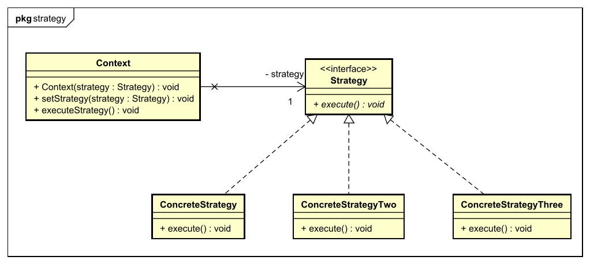

[<small>Zurück zu *Design Patterns*</small>](../)  
[<small>Zurück zur Übersicht</small>](../../)

# Strategy Pattern

### Problembeschreibung

Das Strategy Pattern wird angewendet, wenn man mehrere Klassen hat, die zwar ähnlich sind, aber nicht genau das selbe tun (im Beispiel Klassen für *Enten*). 

- Wenn man alle Subklassen von einer Superklasse mit konkreten Methoden erben lässt, dann haben **alle das selbe Verhalten** oder müssen die Methoden überschreiben!
- Wenn man die Methoden, die für die einzelnen Klassen unterschiedlich sind, in der Superklasse als `abstract` festlegt, muss jede Subklasse diese Methoden **selbst implementieren**. Dann kann es aber passieren, dass von den vielen Subklassen zwei doch den selben Code für diese Methode hat - man hat also eine **Code-Duplizierung**!

Es muss also eine Möglichkeit geben, *Verhaltensklassen* zu definieren, die dann verwendet werden können.

Ein anderes Problem ist, dass Code zur Laufzeit nicht ausgetauscht werden kann. Das Strategy Pattern löst dieses Problem!


### Lösung

- Es gibt Verhaltensklasse, die jeweils eine bestimmte Art von Verhalten definieren. Alle Verhaltensklassen einer Art (*Concrete Strategies*) erben vom selben Interface (*Strategy*).
- Andere Klassen haben Attribute für diese Verhaltensklassen. Weil das Interface als Variablentyp benutzt wird, sind die Verhaltensklassen **austauschbar**! (Mit Setter-Methoden sogar **während der Laufzeit**!)


### Begriffe für die Klassen

- **Context**: Der Kontext ist die Klasse, um die es hauptsächlich geht - eine Klasse, die ein gewisses Verhalten hat. Dieses Verhalten wird über Attribute festgelegt. Es kann bei der Instanzierung im Konstruktor festgelegt und auch zur Laufzeit mittels einer Setter-Methode geändert werden.
- **Strategy**: Die Strategy ist das Interface für alle Verhaltensklassen einer Art. Alle konkreten Verhaltensklassen dieser Art müssen das entsprechende Strategy-Interface implementieren. Damit haben sie alle die **selbe Methoden-Signatur** und sind auch **austauschbar**.
- **Concrete Strategy**: Das ist eine Implementierung des Strategy-Interfaces, das die Methoden implementiert. Wenn in der **Context**-Klasse eine Methode aufgerufen wird, die ein Verhalten benötigt, dann ruft diese Methode die entsprechende Methode in dedr **Concrete Strategy** auf. Der Methodenaufruf wird also **delegiert**.




### Beispiel: Enten-Simulator

#### Die Strategy: QuackBehavior

Das Interface `QuackBehavior` definiert die Verhaltensklassen für das Quaken:

```java
public interface QuackBehavior {
    public void quack();
}
```


#### Die konkrete Strategy: Quak-Verhaltensklassen

Es gibt dann mehrere Klassen, die das Interface `QuackBehavior` implementieren, zum Beispiel `Quack` - diese Klasse stellt einfach ein normales, natürliches Quaken dar.

```java
public class Quack implements QuackBehavior {
   public void quack() {
      System.out.println("Quack");
   }
}
```


#### Der Context: Enten-Klassen

In diesem Fall gibt es mehrere Klassen für unterschiedliche Arten von Enten (Stockenten (`MallardDuck`), Rotkopfenten (`RedheadDuck`), aber auch Gummienten (`RubberDuck`) und Enten-Attrappen (`DecoyDuck`) etc.). Alle diese Klassen erben von einer abstrakten Superklasse `Duck`. Das ist aber fürs Strategy Pattern nicht wichtig.

Auf jeden Fall können manche dieser Enten quaken, andere nicht, die Enten-Attrappe hat ein künstliches Quaken...

Die Quak-Verhaltensklasse wird **im Konstruktor gesetzt** (je nach Art der Ente):

```java
public MallardDuck() {
	this.quackBehavior = new Quack();
}
```

Sie kann aber auch **zur Laufzeit geändert werden**:

```java
public void setQuackBehavior(QuackBehavior qb) {
   this.quackBehavior = qb;
}
```

Es gibt eine Methode `performQuack()`, die dann die entsprechende Methode in der Verhaltensklasse aufruft:

```java
public void performQuack() {
   this.quackBehavior.quack();
}
```