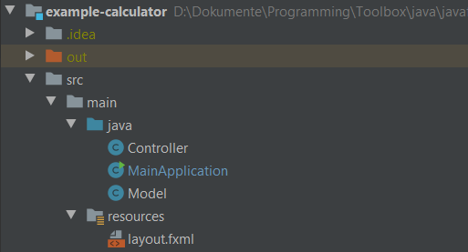
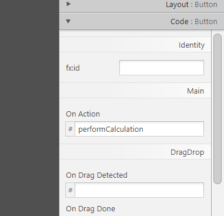

[Zurück zur Übersicht](../../README.md)  
[Zurück zu *Java*](../)

# Java: GUIs erstellen mit JavaFX

JavaFX ist die Standard-Library zum Erstellen von GUIs in Java und hat die ältere *Swing*-Library abgelöst. JavaFX sollte standardmäßig in jedem neueren JDK enthalten sein.

Dieses Dokument erklärt die wichtigsten Punkte von JavaFX anhand einer einfachen MVC-Anwendung. Der komplette Code ist [hier](TODO) verfügbar.


## Organisation des Projekts

Bei JavaFX-Anwendungen ist eine gute, sinnvolle Ordnerstruktur von Vorteil. Viele Features von JavaFX (zum Beispiel die *Injection* von Variablen im Controller) funktionieren nur bei sinnvoll strukturierten Projekten.

Ich habe in diesem Projekt die folgende Ordnerstruktur gewählt:

- Die übergeordneten Ordner `src/main`, in denen der gesamte Code liegt
- Darin die Ordner `java` (in IntelliJ als *Sources Root* markiert) für die Java-Klassen und `resources` (in IntelliJ als *Resources Root* markiert) für FXML-Dateien und alles, was sonst noch so benötigt werden könnte.

Das sieht in IntelliJ dann so aus:




## Die MVC-Komponenten

Bevor man anfängt, wirklich mit den Komponenten zu arbeiten und Code zu schreiben etc., sollte man zumindest die `.java`-Dateien für die Controller-Klasse und die Main-Klasse erstellen.


### Die View, Teil I: Festlegen des Layouts

In JavaFX wird die View üblicherweise nicht über Java-Code erstellt. Stattdessen wird eine `.fxml`-Datei benutzt, die das Layout festlegt. Es handelt sich dabei um eine leicht modifizierte Variante von XML. Das Prinzip von *FXML* ist ähnlich wie das von HTML: Verschiedene Elemente werden verschachtelt, über Attribute können sie konfiguriert werden.

Die View wird am einfachsten mit dem *JavaFX Scene Builder* erstellt. Dort kann man seine GUI schnell zusammenbasteln. Hier ein Screenshot von der GUI aus dem Taschenrechner-Beispiel:


Auf der linken Seite unter *Library* sind die verfügbaren Elemente aufgelistet. Unter *Document* sieht man die Struktur der GUI. Auf der rechten Seite kann man, wenn man ein Element der GUI auswählt, in den drei Tabs *Properties*, *Layout* und *Code* verschiedenste Attribute festlegen.


### Die View, Teil II: Die Anwendungsklasse

Hier geht es um die Anwendungsklasse, in der unter anderem die FXML-Datei eingelesen und das GUI-Fenster erstellt wird.

Man erstellt eine Subklasse von `javafx.application.Application`. Das ist eine abstrakte Klasse und der Einstiegspunkt für JavaFX-Anwendungen. Die einzige abstrakte Methode, die damit auf jeden Fall überschrieben werden muss, ist `start()`. `start()` hat einen Parameter vom Typ `javafx.stage.Stage`. Diese *Stage* ist eigentlich nichts anderes als das GUI-Fenster und damit der übergeordnete Container, der alle anderen GUI-Elemente enthält.

In `start()` passiert (üblicherweise) folgendes:

- Man lädt mit der statischen Methode die FXML-Datei (dafür gibt es die Klasse `javafx.fxml.FXMLLoader`)
- Man setzt den Titel für die Stage (also das Fenster)
- Man weist der Stage eine *Scene* zu. Die Scene ist sozusagen die Ansicht der GUI und der nächste Container innerhalb der *Stage*.
- Man zeigt die Stage an.

Der Code dazu sieht zum Beispiel so aus:

``````java
@Override
public void start(Stage primaryStage) throws Exception{
    Parent root = FXMLLoader.load(getClass().getResource("layout.fxml"));
    primaryStage.setTitle("Calculator");
    primaryStage.setScene(new Scene(root, 300, 275));
    primaryStage.show();
}
``````

Zum Starten der Anwendung wird in einer `main()`-Methode (die auch zur Anwendungsklasse gehören kann) die statische Methode `launch()` der abstrakten `Application`-Klasse aufgerufen. Diese Methode erstellt eine Instanz der Anwendungsklasse, ruft die `start()`-Methode auf und startet damit die Anwendung. <sup>[[1]](#Quellen)</sup>


#### Der Lebenszyklus einer Anwendung

Die abstrakte Klasse `Application` hat einen genau definierten Lebenszyklus: <sup>[[2]](#Quellen)</sup>

- Die Methode `launch()` der Klasse `Application` wird aufgerufen
- Die JavaFX-Lautzeitumgebung wird gestartet
- Es wird eine Instanz der Anwendungsklasse erstellt
- Die Methode `init()` der `Application`-Klasse wird aufgerufen.
- Die Methode `start()`, die in der eigenen Anwendungsklasse überschrieben wurde, wird aufgerufen und die Anwendung wird gestartet.
- Nach dem Starten wird die Anwendung ausgeführt…
- Bevor die Anwendung beendet wird (zum Beispiel, weil man das Fenster schließt), wird die Methode `stop()` aufgerufen.

Die Methoden `init()` und `stop()` der `Application`-Klasse können sehr nützlich sein. Standardmäßig tun sie nichts. Man kann sie aber in der eigenen Anwendungsklasse überschreiben, um vor dem Starten die Anwendung zu initialisieren bzw. vor dem Beenden noch Code auszuführen.


### Der Controller

Als nächstes wird die Controller-Klasse erstellt. Diese Klasse arbeitet mit der GUI, reagiert auf Events und zeigt Ausgaben an.


#### Verbindung zur View

Um die Verbindung zwischen View und Controller herzustellen, muss man sowohl im Controller selbst, als auch in der FXML-Datei einige Dinge hinzufügen. JavaFX bietet aber einige praktische Features, die man sich dabei zunutze machen kann.


##### Festlegen der Controller-Klasse in der View

Im *Scene Builder* kann man den Namen der Controller-Klasse eingeben, die für die Verarbeitung von Events zuständig sein soll. Das ist nicht *unbedingt* notwendig, hilft aber. Dadurch kann man nämlich Methoden des Controllers in der View verknüpfen. <sup>[[3]](#Quellen)</sup>

Die Möglichkeit dazu hat man im Scene Builder links unten unter *Document* im Tab *Controller*. Hier kann man bei *Controller Class* den Klassennamen eintragen. Damit die Klasse gefunden werden kann, müssen natürlich auch Package-Namen angegeben werden, wenn die Klasse in einem Package liegt.

In der vom Scene Builder erstellten FXML-Datei wird der Controller folgendermaßen angegeben:

``````xml
<GridPane xmlns="http://javafx.com/javafx/8" xmlns:fx="http://javafx.com/fxml/1" fx:controller="Controller">
    <!-- ... -->
</GridPane>

``````


##### Verbinden der GUI-Elemente

Um vom Controller aus auf die GUI-Elemente zuzugreifen, bietet JavaFX die Möglichkeit von *Injection* an. Das bedeutet: Man legt im Controller auf der einen und in der `.fxml`-Datei auf der anderen Seite fest, wie die Verbindungen erstellt werden sollen, und JavaFX macht den Rest automatisch.

Im *Scene Builder* muss man dazu für alle Elemente, auf die man vom Controller aus zugreifen möchte, eine ID (`fx:id`) festlegen. Das kann man auf der rechten Seite im Tab *Code*:


In FXML wird daraus:

``````xml
<TextField fx:id="input1" promptText="Zahl 1" />
``````

Für die ID gilt: Sie muss ein gültiger Java-Variablenname sein, denn: Auf der anderen Seite der Verbindung, also im Code des Controllers wird sie ebenfalls benutzt.

Man erstellt im Controller einfach Attribute für die jeweiligen GUI-Elemente. Diese Attribute bekommen als Namen die `fx:id` der entsprechenden GUI-Elemente in FXML. Und dann kommt ein bisschen JavaFX-Magie ins Spiel: Die Attribute werden mit der Annotation `@FXML` annotiert. Daran erkennt JavaFX, dass die Attribute mit den GUI-Elementen verbunden werden sollen, und weist ihnen beim Laden der FXML-Datei die entsprechende Referenz zu.

Ein Controller-Attribut für das oben beschriebene Eingabefeld wird also so erstellt:

``````java
@FXML private TextField input1;
``````


##### Initialisieren der GUI-Elemente

Die meisten GUI-Elemente müssen **nicht** initialisiert werden – das macht JavaFX automatisch. Man braucht also nicht extra einen Konstruktor wie `new TextField();` aufrufen.

In manchen Fällen (zum Beispiel bei `ComboBox`-Elementen, also Dropdowns) braucht man aber doch ein paar Codezeilen, um ein Element zu initialisieren. **Achtung**: Das darf **nicht** im Konstruktor des Controllers gemacht werden! Zu dem Zeitpunkt, zu dem der Konstruktor aufgerufen wird, ist die Injection noch nicht passiert und die Verbindung zu den GUI-Elementen noch nicht hergestellt. Außer einer `NullPointerException` wird man so also nicht viel erreichen.

Stattdessen erstellt man im Konstruktor eine Methode `protected void initialize()`, die ebenfalls mit `@FXML` annotiert wird. Diese Methode wird automatisch ausgeführt, nachdem die Injection durchgeführt wurde und die Attribute eine Referenz auf die entsprechenden GUI-Elemente besitzen. <sup>[[4]](#Quellen)</sup>

``````java
@FXML
protected void initialize() {
    // Hier kommt der Code für die Initialisierung der GUI-Elemente hinein
}
``````


##### Event handling

Um GUI-Events im Controller zu verarbeiten, kann man im FXML auch festlegen, welche Methode des Controllers bei einem bestimmten Event ausgeführt werden soll. Im *Scene Builder* gibt es dazu den Tab *Code* auf der rechten Seite. Für grundlegendes, allgemeines Event-Handling kann man *On Action* verwenden, es gibt aber viele verschiedene Events, für die man jeweils eigene Handler definieren kann.

In das Eingabefeld im Scene Builder schreibt man einfach den Methodennamen der entsprechenden Handler-Methode im Controller (**Achtung**: Ohne Klammern!).



Die entsprechende Methode muss natürlich im [festgelegten Controller](#festlegen-der-controller-klasse-in-der-view) existieren, damit das Event Handling funktioniert. Eine genaue Signatur ist nicht vorgegeben. Die Methode kann ein Parameter vom Typ `javafx.event.Event` übernehmen (das übergebene Objekt enthält dann Details zum ausgelösten Event), kann aber auch einfach parameterlos sein. Beides funktioniert. <sup>[[5]](#Quellen)</sup>

``````java
@FXML
protected void performCalculation() {
    // ...
}
``````


#### Die `@FXML`-Annotation

Die Annotation `@FXML` tritt in der Controller-Klasse immer wieder auf. Nicht immer ist sie unbedingt notwendig. Was ist also ihr eigentlicher Zweck?

Die Java-Dokumentation schreibt dazu: <sup>[[6]](#Quellen)</sup>

> Annotation that tags a field or method as accessible to markup.

In einfachen Worten: Die Annotation `@FXML` legt fest, dass der `FXMLLoader`, der die FXML-Datei einliest und daraus das GUI-Fenster erstellt, auf die annotierten Attribute und Methoden zugreifen kann.

Dadurch können zum Beispiel die Attribute auf `private` und Methoden wie `initialize()` oder Event-Handler-Methoden auf `protected` gesetzt werden, und der `FXMLLoader` kann trotzdem darauf zugreifen.


### Die Klasse `Platform`

Die Klasse `javafx.application.Platform` stellt verschiedene statische Methoden zur Verfügung, um mit der JavaFX-Laufzeitumgebung zu arbeiten. Die beiden wichtigsten werden hier erklärt.


#### Beenden der Anwendung mit `Platform.exit()`

`Platform.exit()` ist eine statische Methode, mit der man aus dem Code heraus die Anwendung beenden kann. Dabei ist es egal, aus welchem Thread sie aufgerufen wird. <sup>[[7]](#Quellen)</sup>

Bevor die Anwendung beendet wird, wird noch die Methode `stop()` der [Anwendungsklasse](#Die-view-teil-ii-die-anwendungsklasse) aufgerufen.


#### `Platform.runLater()`

Mit `runLater()` können kleine Aufgaben nebenläufig abgearbeitet werden. <sup>[[8]](#Quellen)</sup> Man übergibt der Methode dazu ein `Runnable`-Objekt, das man zum Beispiel mit einer Lambda-Funktion erstellen kann:

``````java
Platform.runLater(() -> {
    //
    this.input1.clear();
});
``````

Das ist vor allem bei Zugriffen auf die GUI nützlich. Manchmal kommt es vor, dass man (von einem anderen als dem JavaFX-Application-Thread) auf die GUI zugreifen und etwas verändern muss. Dann wird üblicherweise eine `IllegalStateException` mit dem Text *Not on FX application thread* geworfen.

Um diesen Fehler zu beheben, kann man den Code, der auf die GUI zugreift, stattdessen in ein `Runnable`-Objekt schreiben, das dann an `Platform.runLater()` übergeben wird.


## Quellen

[1]	[Class Application - launch(); abgerufen am 20.5.2020](https://docs.oracle.com/javase/10/docs/api/javafx/application/Application.html#launch(java.lang.String...))  
[2]	[Class Application; abgerufen am 20.5.2020](https://docs.oracle.com/javase/10/docs/api/javafx/application/Application.html)  
[3]	[JavaFX Scene Builder: Getting Started with JavaFX Scene Builder; abgerufen am 20.5.2020](https://docs.oracle.com/javafx/scenebuilder/1/get_started/bind-ui-to-logic.htm)  
[4]	[Introduction to FXML; abgerufen am 20.5.2020](https://docs.oracle.com/javase/10/docs/api/javafx/fxml/doc-files/introduction_to_fxml.html#fxml_annotation)  
[5]	[Introduction to FXML; abgerufen am 20.5.2020](https://docs.oracle.com/javase/10/docs/api/javafx/fxml/doc-files/introduction_to_fxml.html#controller_method_event_handlers)  
[6]	[Annotation Type FXML; abgerufen am 20.5.2020](https://docs.oracle.com/javase/10/docs/api/javafx/fxml/FXML.html)  
[7]	[Class Platform - exit(); abgerufen am 20.5.2020](https://docs.oracle.com/javase/10/docs/api/javafx/application/Platform.html#exit())  
[8]	[Class Platform - runLater(); abgerufen am 20.5.2020](https://docs.oracle.com/javase/10/docs/api/javafx/application/Platform.html#runLater(java.lang.Runnable))